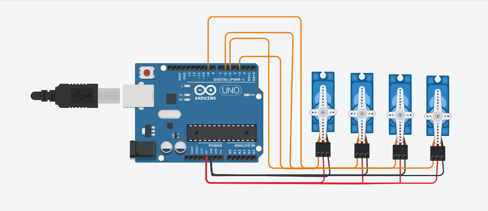
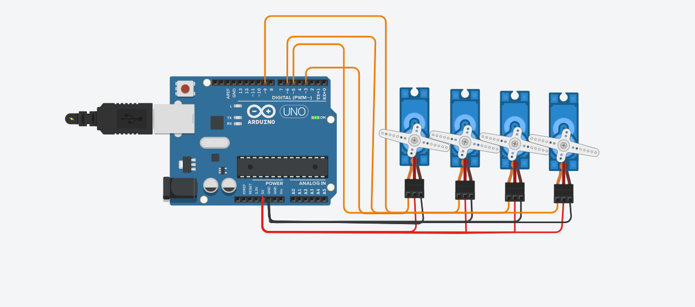
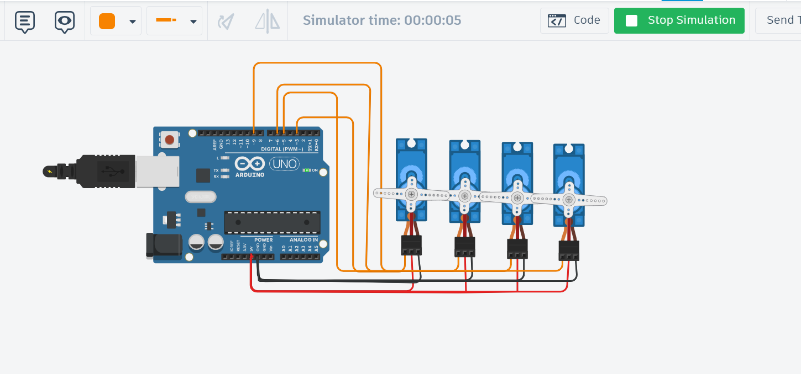

# Arduino 4 Servo Motors Project

## Project Description

This project uses an Arduino UNO to control **4 servo motors**.

The servo motors perform the **Sweep** movement for **2 seconds**, then all motors stop at **90°**.

---

## Components

- Arduino UNO
- 4 × SG90 Servo Motors
- Jumper Wires
- USB Cable

---

## Circuit Connection

| Servo | Arduino Pin |
|-------|-------------|
| Servo 1 | D3 |
| Servo 2 | D5 |
| Servo 3 | D6 |
| Servo 4 | D9 |

### Power Connections

- 🔴 Red → 5V
- ⚫ Black/Brown → GND
- 🟠 Orange → Signal

---

## Circuit Wiring

---

## Simulation Running

---

## Final Position (90°)

---

## Simulation Video

[▶️ Watch the Simulation Video](./Servo_Project.mp4)

---

## Files

- Arduino-4-Servo-Project.ino
- README.md
- image.png
- image2.png
- image3.png
- Servo_Project.mp4

---

## Result

- Four servo motors move together.
- Sweep movement runs for **2 seconds**.
- All servo motors stop at **90°**.
- Project completed successfully.
